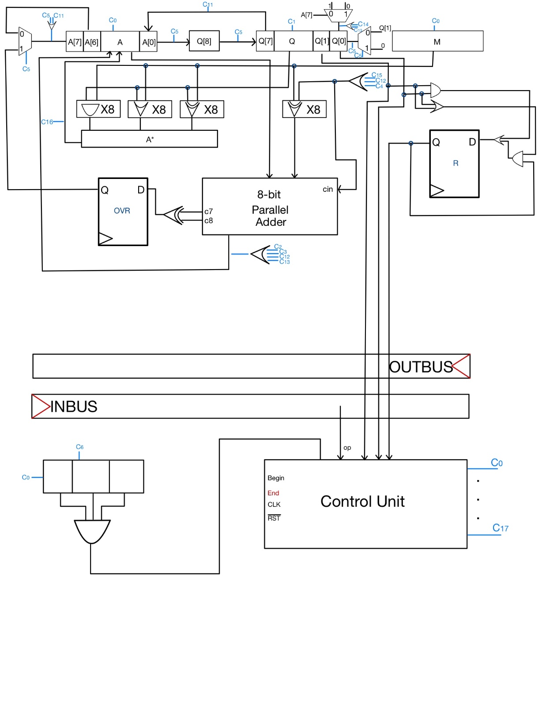
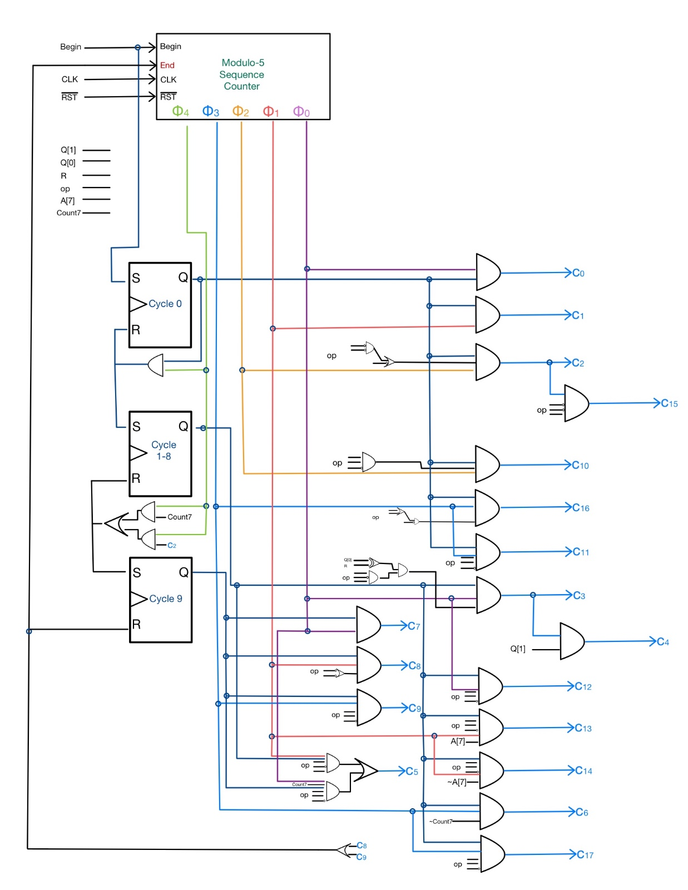

# ALU (Arithmetical Logic Unit)

Hardware implementation of a finite-state automata that is able to add, subtract, multiply, divide and perform logical operations (AND, OR and XOR) between two 8-bit inputs. cacc

Developed in collaboration with https://github.com/Alexia-Crisan.

## Overview Diagram

## Control Unit State Diagram

